# 아이폰 어플 만들기 01 - iOS 개발환경 세팅하기


iOS 개발에 앞서 개발환경을 세팅해야 합니다.

iOS는 Xcode를 사용해 개발 할 수 있으며, 당연하지만 Mac book, Mac Mini , iMac 등의 Mac 제품이 필요합니다.


<hr>


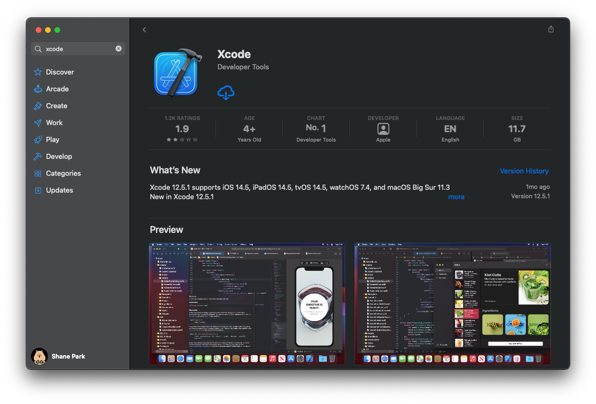

> 평점 상태가..

당연하게도 Xcode는 Appstore에서 다운 받을 수 있습니다. 하지만..


> 아름다운 Size를 보시라..


용량이 무려 11.7 GB 입니다. 다들 아시겠지만 앱스토어에서 뭔가 다운받을때는 속도가 애매합니다.

그래서. https://developer.apple.com/download/all/ 에서 다운받는 것을 권장합니다.


> 해당 페이지에 들어가면 Xcode beta 버전이 제일 먼저 보이는데요, 스크롤을 조금 내리면


Appstore에 올라온 버전과 일치하는 버전을 찾을 수 있습니다. Xcode 12.5.1.xip 를 클릭해 10.98 GB 파일을 다운 받습니다.


> 34.5 MB/sec 로 나쁘지 않은 다운로드 속도가 나옵니다.


App Store에서 불안전한 속도로 다운 받는것보다 개인적으로는 홈페이지 다운을 권장합니다.


다운받는 동안 command Line Tools 가 설치되었는지도 확인 해 보는게 좋겠는데요, 보통 Homebrew를 사용하신다면 설치 되어 있을 확률이 높습니다.


터미널에 아래와 같이 입력해 봅니다.

```shell
gcc --version
```

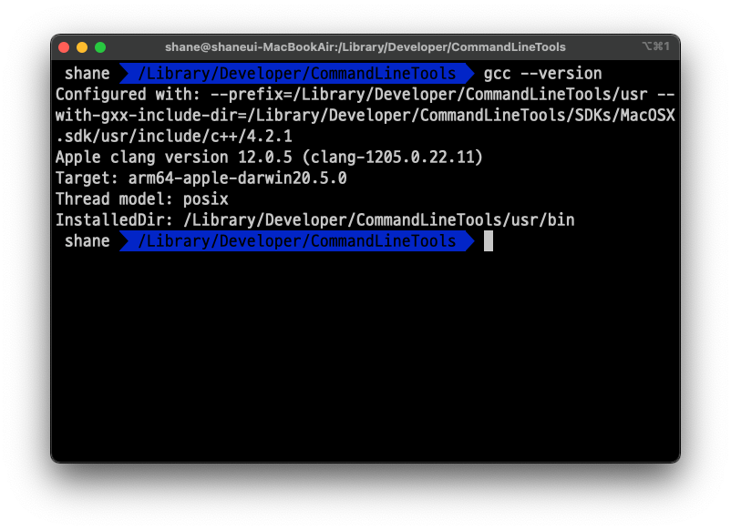

저처럼 설치 경로나 버전에 대한 정보가 나온다면 설치가 되어 있는 거고요, no developers tools were found at ... 라며 에러가 나온다면 설치되어 있지 않은 겁니다. 

혹시 CLT가 설치 되어 있지 않으면

```shell
xcode-select --install
```


을 입력해서 설치하시면 됩니다. 아니면 저 위에서 다운 받아도 되겠네요.


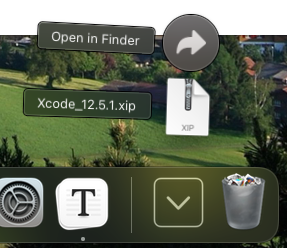

> Xcode 다운로드가 완료되었습니다.


바로 실행해서 압축을 풀어 줍니다. 용량이 크다보니 시간이 제법 소요됩니다.


>체감상 한 5분은 걸린 듯 하니 무작정 기다리기 보다 할일을 하고 있는게 정신 건강에 이롭습니다.


이렇게 짠 ! 하고 압축이 풀립니다. 

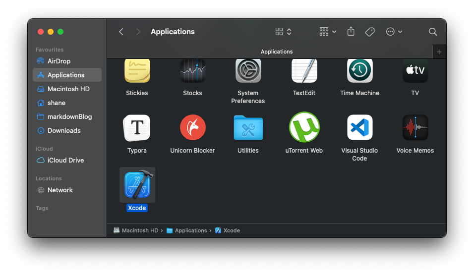

바로 Applications로 옮겨주고, .xip 파일을 삭제해 주시면 됩니다. 

바로 실행 해 보겠습니다.

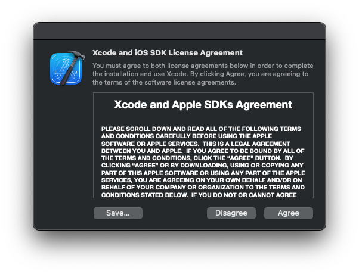

SDK Lisence Agreement. 즉 Software Developer Kit 사용에 대한 동의를 합니다.

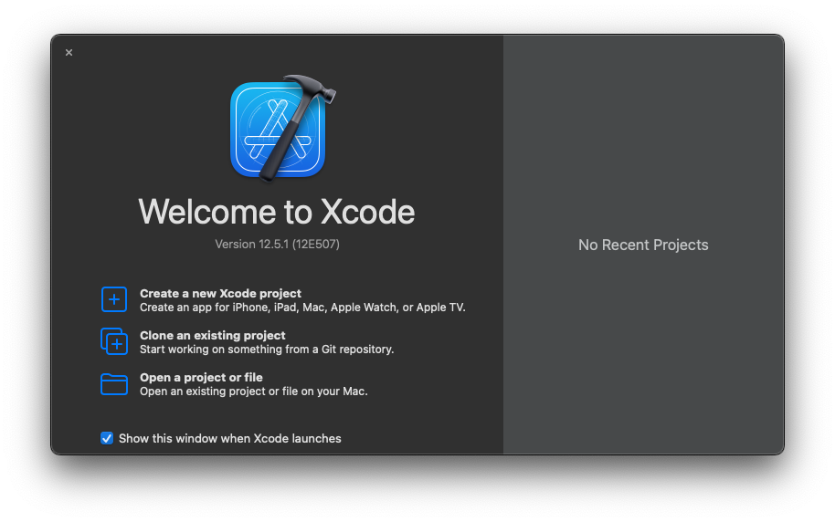

실행이 완료되었습니다. Apple Silicon에서 native로 실행되어서 그런지, 대용량의 어플리케이션 치고는 가볍게 열리는 느낌입니다.

제일 위에 있는 Create a new Xcode project를 클릭해 보겠습니다.


> 몇가지 template들이 나오는데요


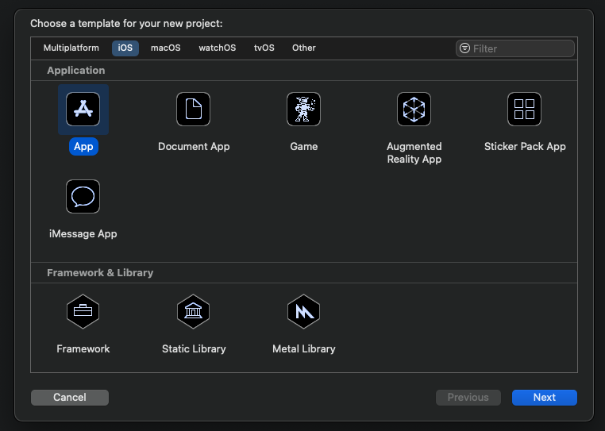

iOS를 선택하고 App을 만들어 보도록 하겠습니다.


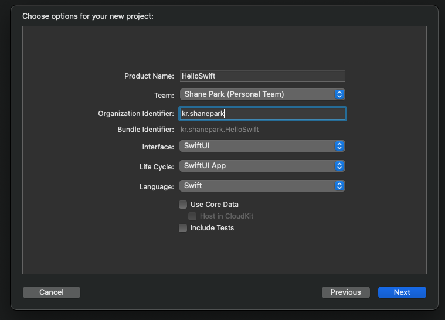


여러가지 설정 항목들이 나옵니다.

- Product Name

  > 프로젝트 이름 입니다. 앱 이름은 나중에 따로 설정 할 수 있으며, 설정하지 않으면 프로젝트의 이름이 앱 이름으로 사용됩니다. UpperCamelCase로 작성하도록 합니다.

- Team

  > 팀 이름 입니다. 어플리케이션이 배포될 때 이름으로 들어갈 듯 합니다.

- Organization Identifier

  > Bundle Identifier를 생성하는데 사용되는 prefix 입니다. 웹 프로젝트 만들었을 때 처럼, 도메인을 뒤집어서 사용하는 것이 컨벤션 입니다.

나머지는 따로 설정 하지 않겠습니다. 

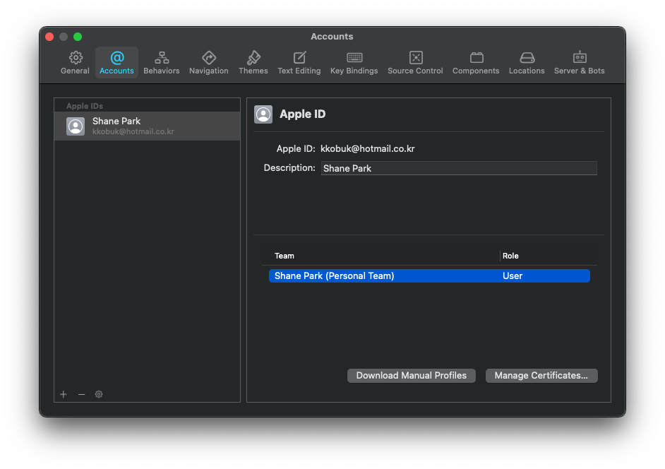

> Team은 선택 하면 personal team Profile을 다운 받을 수 있습니다. 


Next 버튼을 누릅니다.


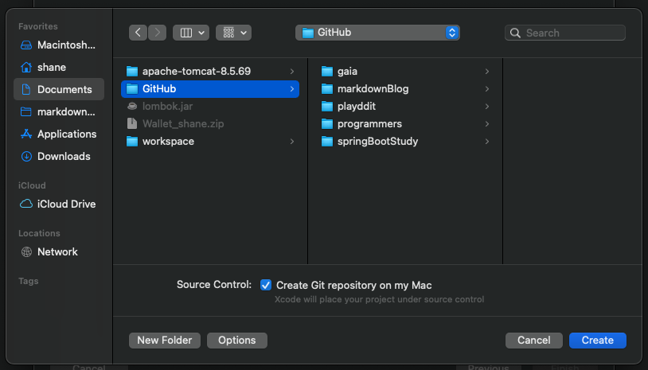

> 저장할 경로를 선택하게 되는데요. 적당히 원하는 곳을 지정합니다.

Source Control : Create Git repository on my Mac은, 해당 프로젝트를 Git으로 버전관리 하실 생각이면 체크 하시면 됩니다. git init 하지 않아도 되고 참 편하네요.

어차피 하위 폴더가 만들어지고, 해당 폴더에 .git이 생성되기 때문에 프로젝트를 위해 따로 폴더를 생성 해 주실 필요는 없습니다.

저는 Github 폴더를 선택하겠습니다. Create를 클릭해 생성합니다.


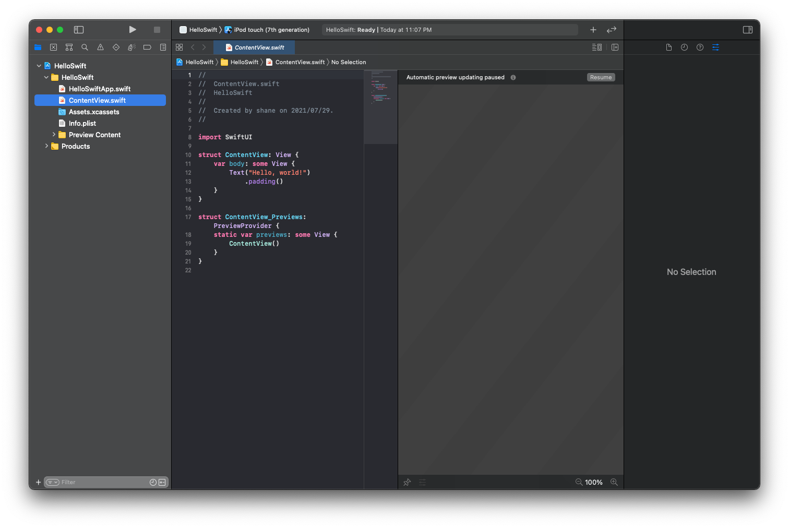


>  새로운 iOS 어플리케이션을 만드셨습니다 !


### 좌측에 보이는 Navigator area 입니다.

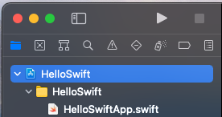

### 

제일 왼쪽부터 

- Show the Project navigator
- Show the Source Control navigator
- Show the Symbol Navigator
- Show the Find Navigator

그 외에 Issue, Test, Debug, Break Point, Report 등이 있습니다. 한번씩 편하게 클릭해보면 됩니다.


> 디버그 아이콘이 정말 재밌습니다.

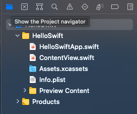

> 가장 기본적인 Show the Project Navigator를 많이 사용하게 되겠네요.


### Editor Area 입니다.

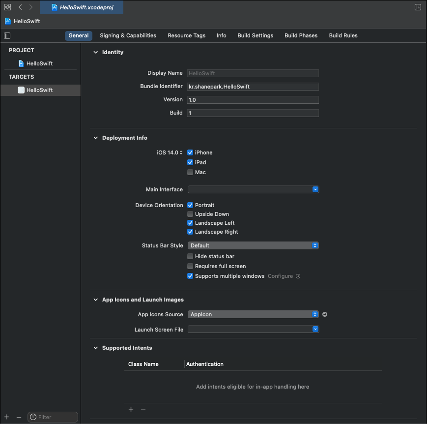

Navigator Area에서 선택을 할 때마다, Editor Area에 표시되는 내용이 변경됩니다.

예를 들어, ContentView.swift를 선택한다면


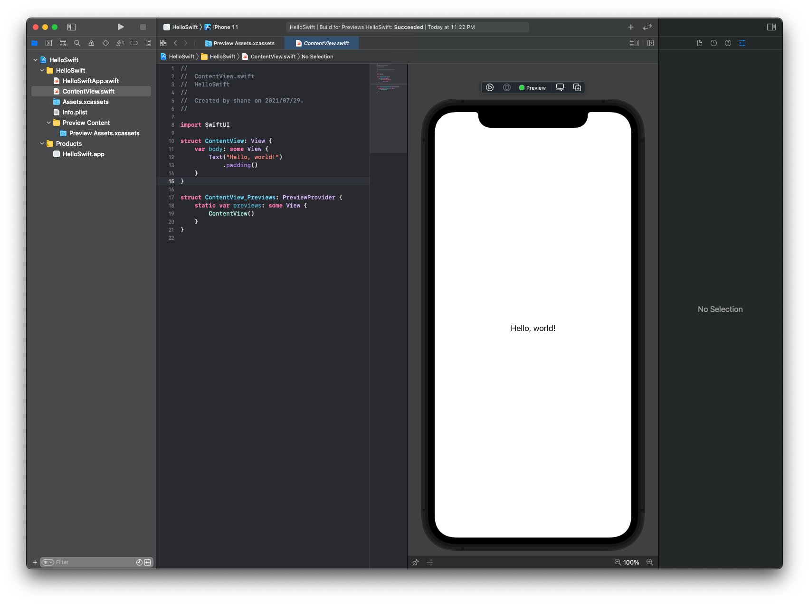

이렇게, 화면 구성을 확인 할 수 있습니다.


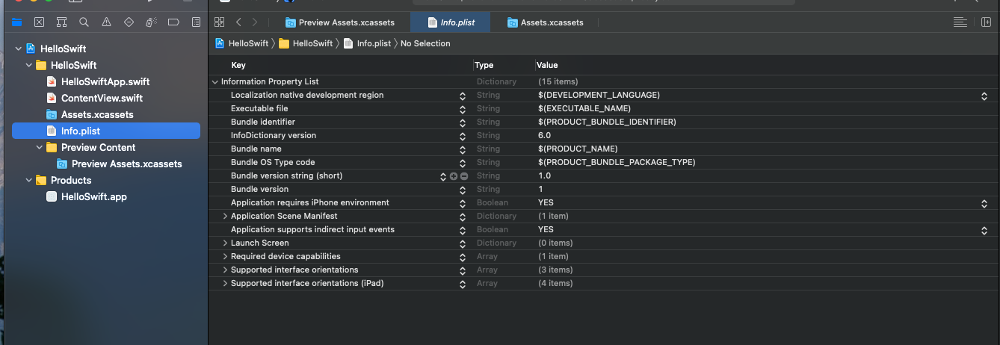

> Info.plist 에는 설정값들을 기록합니다.


### 우측의 Utilities pane 입니다. 

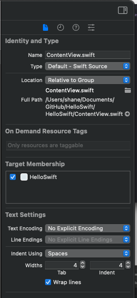


Editor area에서 무엇을 클릭하는지에 따라 보이는게 달라집니다.

물론 몇가지 Tab이 더 있습니다만 넘어 가겠습니다.


### 상단의 Xcode toolbar 입니다


앱을 실행할 수 있는 버튼과 정지하는 버튼, 그리고 그 우측에는 

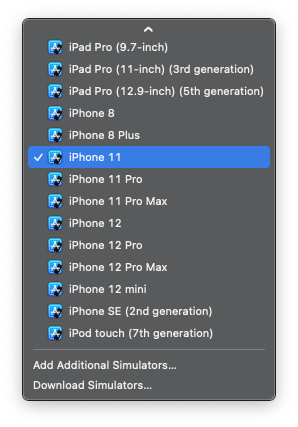

App을 실행할 destination 을 선택 할 수 있는 dropbox가 있습니다.


그리고 중간에는 


status bar가 있습니다.


앱 실행 버튼을 눌러 빌드를 한번 해 보도록 하겠습니다.


금방 아이폰 앱이 하나 실행됩니다. Command + 1 ~ Command 4 버튼을 입력해 Simulator의 사이즈를 변경 할 수 있습니다.

>  1에서 3 까지 점점 커지며 4는 모니터에 맞는 사이즈로 지정이 됩니다.


🛑 버튼을 눌러 simulator를 종료 할 수 있습니다.


이제 화면에 몇가지 UI Elements를 추가해 보도록 하겠습니다.


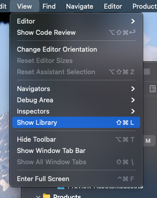

상단의 View - > Show Libary 를 클릭하거나 Shift + Command + L 을 입력합니다.


바로 Libarary 를 확인 할 수 있습니다. Java Swing이나 PyQt가 생각나네요.


Label을 검색 하고


보이는 것 처럼 드래그를 하는데,  Command 키를 누른 상태로 드래그 하면 덮어 쓸 수도 있습니다.


마지막으로 Hello world로 글자를 변경하고 마치겠습니다.

첫번째 아이폰 어플리케이션을 만드셨습니다 !